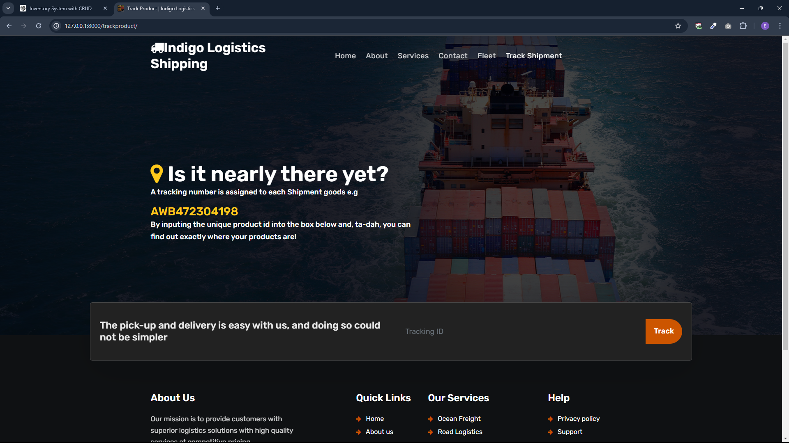

# Product Tracking Application with Django



Welcome to our product tracking application repository, built using Django for backend functionality and HTML/CSS/JS for the frontend. This application allows users to track products purchased from the company using their tracking IDs. It utilizes a custom account model instead of the built-in Django user model and integrates with Cloudinary for storage.

## Overview

This project provides the following functionalities:

- **Product Tracking**: Users can enter a product's tracking ID to locate and view details of products purchased from the company.
- **Custom Accounts**: Implements a custom account model for user authentication and management.
- **Frontend**: Built with HTML, CSS, and JavaScript for a responsive and interactive user interface.
- **Cloudinary Integration**: Utilizes Cloudinary for storing product images and other media assets securely.

## Getting Started

To get started with this project, follow these steps:

1. **Clone the repository**:

   ```bash
   git clone https://github.com/ehiremengold/product-tracking-app.git
   cd product-tracking-app
2. **Set up Locally:
   ```bash
   python -m venv venv
   source venv/bin/activate  # On Windows, use `venv\Scripts\activate`
   pip install -r requirements.txt
3. Set up Cloudinary
   - Sign up for a Cloudinary account and obtain API credentials (cloud name, API key, API secret).
   - Configure Cloudinary settings in your Django project (typically in settings.py).
4. Run migrations:
     ```bash
   python manage.py makemigrations
   python manage.py migrate
5. Create Superuser (for admin access)
   ```bash
   python manage.py createsuperuser
6. Run development server: `python manage.py runserver`
7. Explore and use the application:
    - Access the Django admin at http://localhost:8000/admin/ to manage products, users, etc.
    - Use the web interface (http://localhost:8000/) to track products using their tracking IDs.
